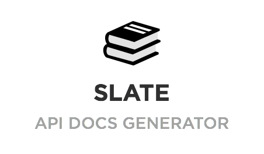
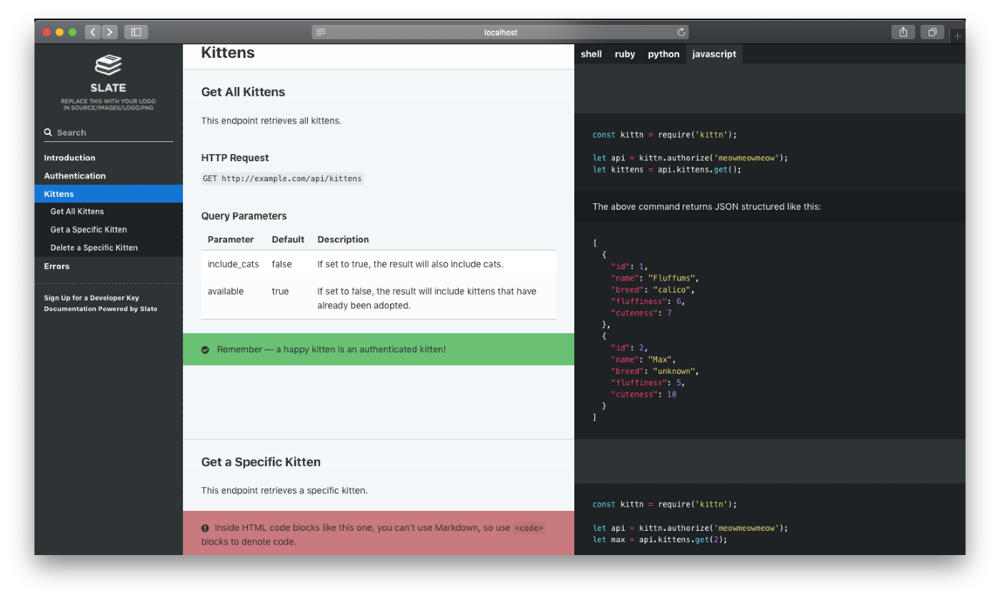
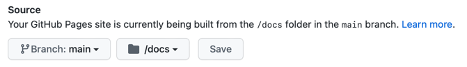

<p align="center">
  
  <br>
  <p align="center">A simplified, Docker only setup for <a href="https://github.com/slatedocs/slate">slatedocs/slate</a>. </p>
</p>

<p align="center">Slate helps you create beautiful, intelligent, responsive API documentation.</p>

<p align="center"></p>

<p align="center"><em>The example above was created with Slate. Check it out at <a href="https://slatedocs.github.io/slate">slatedocs.github.io/slate</a>.</em></p>

Why another setup? 🤷
------------------------------
It's a template for slim, docker-only <a href="https://github.com/slatedocs/slate">slatedocs/slate</a> setup. 
The changes (from original slatedocs) are the following:

- Removed all the files except the source files and a few others.
- Using `slatedocs/slate` pre-built docker image for generating the docs.
- Added `.sh` files as `build` and `serve` command shortcut.
- Added a new aside type `<aside class="pre">` to show preformatted, multiline code in the middle column. 

How to use this repo?
------------------------------

To start building your API Documentation with slate, 

- Make a repository from this template.
- clone that repository
- For the first time, give the sh files permission to execute
```shell
chmod +x ./serve.sh
chmod +x ./build.sh
```

**Now, your setup is complete!** 

The source files are in `./source` directory.  
And, generally, the only file you need to edit is `source/index.html.md`. 

Let's make beautiful API Doc
----------------
1. For preview of the documentation site, run
```shell
./serve.sh
# The preview is available at http://127.0.0.1:4567
```
2. Now you can [make changes](https://github.com/slatedocs/slate/wiki/Markdown-Syntax) in `source/index.html.md` to prepare your API Documentation. 
3. Verify your changes by reloading the preview time to time.
4. After every significant progress, to build the site, run
```shell
./build.sh
``` 

Now your static documentation site is ready in `./docs` folder.  
You are free to deploy the files anywhere, without any dependency. 

> **Warning:** Remember to add and commit the changes of `./docs/*` files.


### Display multiline code or JSON in the middle column

Slatedocs pulls all multiline code blocks to the third column. 

This setup added a new class `pre`, that will show preformatted code in the middle column.
```html
<aside class="pre">
{
    "status": "completed",
    "is_anonymous": false
}
</aside>
```

> **Note:** Slate comes with 3 built in class for showing blocked notes: `notice`, `warning` and `success`.
> 
Deploy API Documentation as Github Pages
---------------------------------
The `./build.sh` will update static build in `./docs` folder.

So, to publish the documentation with Github Pages, 
1. From settings page of your repository, enable Github pages and set `/docs` as the source of the publishing site.
  
2. Build with `./build.sh`
3. Commit (with including all changes in `/source` and `/docs`)
4. Push. You should see the changes published in Github Page url.


Features
------------

* **Clean, intuitive design** — With Slate, the description of your API is on the left side of your documentation, and all the code examples are on the right side. Inspired by [Stripe's](https://stripe.com/docs/api) and [PayPal's](https://developer.paypal.com/webapps/developer/docs/api/) API docs. Slate is responsive, so it looks great on tablets, phones, and even in print.

* **Everything on a single page** — Gone are the days when your users had to search through a million pages to find what they wanted. Slate puts the entire documentation on a single page. We haven't sacrificed linkability, though. As you scroll, your browser's hash will update to the nearest header, so linking to a particular point in the documentation is still natural and easy.

* **Slate is just Markdown** — When you write docs with Slate, you're just writing Markdown, which makes it simple to edit and understand. Everything is written in Markdown — even the code samples are just Markdown code blocks.

* **Write code samples in multiple languages** — If your API has bindings in multiple programming languages, you can easily put in tabs to switch between them. In your document, you'll distinguish different languages by specifying the language name at the top of each code block, just like with GitHub Flavored Markdown.

* **Out-of-the-box syntax highlighting** for [over 100 languages](https://github.com/rouge-ruby/rouge/wiki/List-of-supported-languages-and-lexers), no configuration required.

* **Automatic, smoothly scrolling table of contents** on the far left of the page. As you scroll, it displays your current position in the document. It's fast, too. We're using Slate at TripIt to build documentation for our new API, where our table of contents has over 180 entries. We've made sure that the performance remains excellent, even for larger documents.

* **Let your users update your documentation for you** — By default, your Slate-generated documentation is hosted in a public GitHub repository. Not only does this mean you get free hosting for your docs with GitHub Pages, but it also makes it simple for other developers to make pull requests to your docs if they find typos or other problems. Of course, if you don't want to use GitHub, you're also welcome to host your docs elsewhere.

* **RTL Support** Full right-to-left layout for RTL languages such as Arabic, Persian (Farsi), Hebrew etc.

Getting started with Slate is super easy! Simply press the green "use this template" button above and follow the instructions below. Or, if you'd like to check out what Slate is capable of, take a look at the [sample docs](https://slatedocs.github.io/slate/).


Companies Using Slate
---------------------------------

* [NASA](https://api.nasa.gov)
* [Sony](http://developers.cimediacloud.com)
* [Best Buy](https://bestbuyapis.github.io/api-documentation/)
* [Travis-CI](https://docs.travis-ci.com/api/)
* [Greenhouse](https://developers.greenhouse.io/harvest.html)
* [WooCommerce](http://woocommerce.github.io/woocommerce-rest-api-docs/)
* [Dwolla](https://docs.dwolla.com/)
* [Clearbit](https://clearbit.com/docs)
* [Coinbase](https://developers.coinbase.com/api)
* [Parrot Drones](http://developer.parrot.com/docs/bebop/)
* [CoinAPI](https://docs.coinapi.io/)

You can view more in [the list on Slate wiki](https://github.com/slatedocs/slate/wiki/Slate-in-the-Wild).
